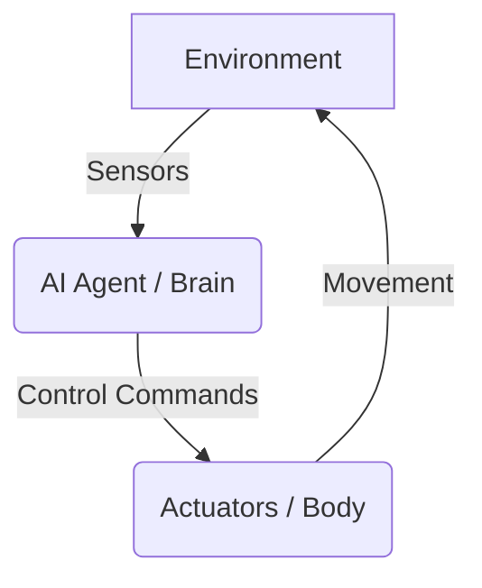

# Introduction to Physical AI: The Foundation of Embodied Intelligence

Physical AI is the field where artificial intelligence intersects with physical systems. Unlike traditional "pure" AI (like chatbots or recommendation engines) that operates purely in digital spaces, **Physical AI** (also known as **Embodied Intelligence**) refers to AI that controls actual physical bodies—robots, drones, or mechanical devices.

Embodied intelligence means the "brain" is not just thinking in isolation; it is deeply connected to a "body" that moves, feels, and interacts with the physical world.

## From Digital AI to Physical AI

The transition from Digital AI to Physical AI is a leap from *prediction* to *action*.

*   **Digital AI**: Receives digital data (text, images), processes it, and outputs more digital data.
*   **Physical AI**: Receives sensory data (LiDAR, IMU, cameras), processes it, and outputs *physical force* (torque, velocity, motion).

This transition brings new challenges: gravity, battery constraints, material friction, and real-time safety.

## Concept: Embodied Intelligence
Embodied intelligence is the idea that intelligence emerges from the interaction between an agent's brain (AI), its body (hardware), and its environment. In humanoid robotics, this means the AI must understand physics, gravity, and spatial relationships to perform tasks.

## Architecture Diagram

*Description: A closed-loop system where sensors provide feedback from the environment to the AI agent, which then sends commands to actuators to interact with that environment.*

## Course Roadmap
This book is organized into six core modules that guide you from the basics of robotic systems to an autonomous humanoid capstone project:

1.  **Module 1: The Robotic Nervous System (ROS 2)** - Building the communication infrastructure.
2.  **Module 2: The Digital Twin (Gazebo & Unity)** - Simulating physics before moving to hardware.
3.  **Module 3: The AI-Robot Brain (NVIDIA Isaac)** - High-fidelity AI acceleration for robotics.
4.  **Module 4: Vision-Language-Action (VLA)** - Teaching robots to understand and act on natural language.
5.  **Module 5: Hardware & Lab Architecture** - The physical workstations and edge computers (Jetson) needed.
6.  **Module 6: Capstone – Autonomous Humanoid** - Bringing it all together into an integrated system.

## Tooling Stack
- **ROS 2 (Robot Operating System)**: The middleware for communication.
- **Python/C++**: Primary programming languages.
- **Neural Networks**: For perception and decision making.
- **Physics Engines**: For simulation (Gazebo, MuJoCo).

## Practical Learning Goals
1. Understand the difference between Passive and Physical AI.
2. Identify the core components of an embodied system.
3. Learn how feedback loops drive robotic behavior.
4. Understand the overall structure and objectives of this course.
5. Recognize the transition from digital to physical AI systems.
