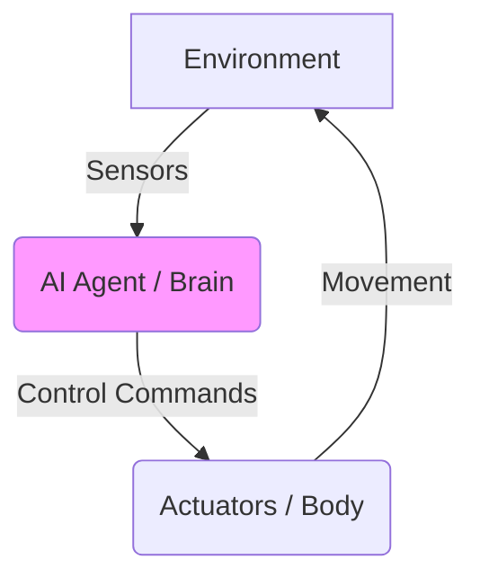

# Introduction to Physical AI

Physical AI refers to the integration of artificial intelligence with physical systems, enabling machines to perceive, reason, and act in the real world. Unlike purely digital AI (like LLMs), Physical AI is about embodied intelligence.

## Concept: Embodied Intelligence
Embodied intelligence is the idea that intelligence emerges from the interaction between an agent's brain (AI), its body (hardware), and its environment. In humanoid robotics, this means the AI must understand physics, gravity, and spatial relationships to perform tasks.

## Architecture Diagram

*Description: A closed-loop system where sensors provide feedback from the environment to the AI agent, which then sends commands to actuators to interact with that environment.*

## Tooling Stack
- **ROS 2 (Robot Operating System)**: The middleware for communication.
- **Python/C++**: Primary programming languages.
- **Neural Networks**: For perception and decision making.
- **Physics Engines**: For simulation (Gazebo, MuJoCo).

## Practical Learning Goals
1. Understand the difference between Passive and Physical AI.
2. Identify the core components of an embodied system.
3. Learn how feedback loops drive robotic behavior.
