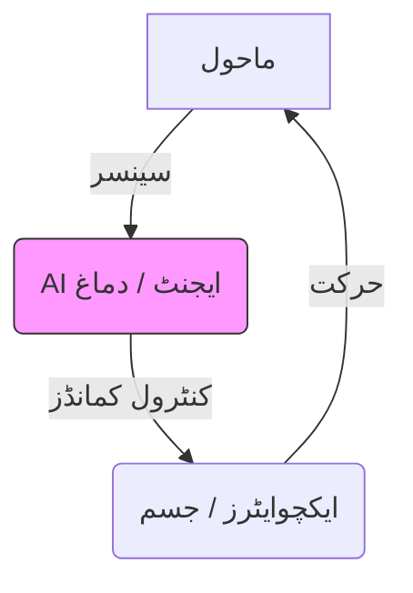

# فزیکل AI کا تعارف

فزیکل AI مصنوعی ذہانت کو جسمانی سسٹم کے ساتھ مربوط کرنے کا حوالہ دیتا ہے، جو مشینوں کو حقیقی دنیا میں دیکھنے، سوچنے اور کام کرنے کے قابل بناتا ہے۔ صرف ڈیجیٹل AI (جیسے LLMs) کے برعکس، فزیکل AI جسمانی ذہانت کے بارے میں ہے۔

## تصور: جسمانی ذہانت

جسمانی ذہانت کا خیال یہ ہے کہ ایک ایجنٹ کے دماغ (AI)، اس کے جسم (ہارڈ ویئر)، اور اس کے ماحول کے درمیان تعامل سے ذہنت پیدا ہوتی ہے۔ ہیومنوڈ روبوٹکس میں، اس کا مطلب ہے کہ AI کو کام انجام دینے کے لیے طبیعیات، کشش ثقل، اور جگہ کے تعلقات کو سمجھنا ہوگا۔

## آرکیٹیکچر ڈایاگرام

*وضاحت: ایک بند لوپ سسٹم جہاں سینسر ماحول سے فیڈبک فراہم کرتے ہیں AI ایجنٹ کو، جو پھر اس ماحول کے ساتھ تعامل کرنے کے لیے ایکچوایٹرز کو کمانڈز بھیجتا ہے۔*

## ٹولنگ اسٹیک
- **ROS 2 (Robot Operating System)**: مواصلات کے لیے مڈل ویئر
- **Python/C++**: بنیادی پروگرامنگ زبانیں
- **نیورل نیٹ ورکس**: فیصلہ سازی کے لیے
- **طبیعیات انجنز**: سمولیشن کے لیے (Gazebo, MuJoCo)

## عملی سیکھنے کے اہداف
1. منفی اور فزیکل AI کے درمیان فرق سمجھیں
2. جسمانی سسٹم کے اہم اجزا کی نشاندہی کریں
3. سیکھیں کہ فیڈبک لوپس روبوٹک رویے کو کیسے چلاتے ہیں
