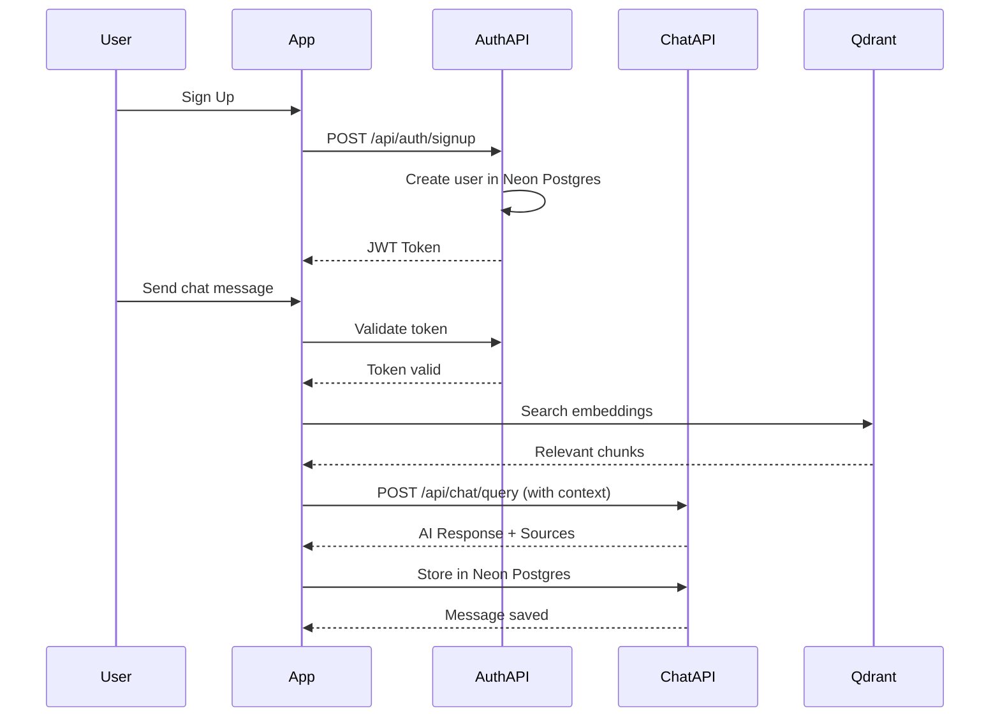

# API Contracts: Physical AI & Humanoid Robotics Book

**Feature Branch**: `feature/physical-ai-humanoid-robotics-book`
**Generated**: 2025-12-30
**Research**: [specs/feature/physical-ai-humanoid-robotics-book/research.md](specs/feature/physical-ai-humanoid-robotics-book/research.md)

> **Note**: This is a static site with client-side components. These "contracts" define the external API integrations for RAG chatbot, authentication, and database operations.

---

## 1. Authentication API (Better-Auth)

### Sign Up

**Endpoint**: `POST /api/auth/signup`

**Request**:
```json
{
  "email": "user@example.com",
  "password": "securepassword123",
  "name": "John Doe",
  "background": "software"
}
```

**Response** (201 Created):
```json
{
  "user": {
    "id": "uuid",
    "email": "user@example.com",
    "name": "John Doe",
    "background": "software"
  },
  "session": {
    "token": "jwt-token-here",
    "expiresAt": "2025-12-31T00:00:00Z"
  }
}
```

**Errors**:
- 400: Invalid input
- 409: Email already exists

### Sign In

**Endpoint**: `POST /api/auth/signin`

**Request**:
```json
{
  "email": "user@example.com",
  "password": "securepassword123"
}
```

**Response** (200 OK):
```json
{
  "user": {
    "id": "uuid",
    "email": "user@example.com",
    "name": "John Doe",
    "background": "software",
    "preferences": {
      "contentDepth": "detailed",
      "language": "en"
    }
  },
  "session": {
    "token": "jwt-token-here",
    "expiresAt": "2025-12-31T00:00:00Z"
  }
}
```

### Update Profile

**Endpoint**: `PUT /api/auth/profile`

**Headers**: `Authorization: Bearer {token}`

**Request**:
```json
{
  "background": "hardware",
  "preferences": {
    "contentDepth": "simplified",
    "language": "ur"
  }
}
```

**Response** (200 OK):
```json
{
  "user": {
    "id": "uuid",
    "background": "hardware",
    "preferences": {
      "contentDepth": "simplified",
      "language": "ur"
    }
  }
}
```

---

## 2. RAG Chatbot API

### Chat Query

**Endpoint**: `POST /api/chat/query`

**Headers**: `Authorization: Bearer {token}`

**Request**:
```json
{
  "message": "What is Physical AI?",
  "sessionId": "uuid-session-id",
  "selectedText": "optional selected text from page",
  "contextMode": "full-book" // or "selected-text"
}
```

**Response** (200 OK):
```json
{
  "response": "Physical AI is...",
  "sources": [
    {
      "chapterId": "intro",
      "chapterTitle": "Introduction to Physical AI",
      "relevanceScore": 0.95,
      "excerpt": "Physical AI is the field where..."
    }
  ],
  "sessionId": "uuid-session-id",
  "tokensUsed": 150
}
```

**Errors**:
- 401: Unauthorized
- 429: Rate limited
- 500: RAG pipeline error

### Chat History

**Endpoint**: `GET /api/chat/history?sessionId={sessionId}`

**Headers**: `Authorization: Bearer {token}`

**Response** (200 OK):
```json
{
  "messages": [
    {
      "id": "uuid",
      "role": "user",
      "content": "What is Physical AI?",
      "createdAt": "2025-12-30T10:00:00Z"
    },
    {
      "id": "uuid",
      "role": "assistant",
      "content": "Physical AI is...",
      "sources": [...],
      "createdAt": "2025-12-30T10:00:01Z"
    }
  ]
}
```

### Start New Session

**Endpoint**: `POST /api/chat/session`

**Headers**: `Authorization: Bearer {token}`

**Response** (201 Created):
```json
{
  "sessionId": "new-uuid-session-id",
  "createdAt": "2025-12-30T10:00:00Z"
}
```

---

## 3. User Preferences API

### Get Preferences

**Endpoint**: `GET /api/user/preferences`

**Headers**: `Authorization: Bearer {token}`

**Response** (200 OK):
```json
{
  "preferences": {
    "contentDepth": "detailed",
    "language": "en",
    "theme": "system",
    "chapterProgress": {
      "intro": "completed",
      "module-1/intro-to-physical-ai": "in-progress"
    },
    "bookmarks": [
      {
        "chapterId": "intro",
        "section": "concept-explanation",
        "note": "Important definition"
      }
    ]
  }
}
```

### Update Preferences

**Endpoint**: `PUT /api/user/preferences`

**Headers**: `Authorization: Bearer {token}`

**Request**:
```json
{
  "contentDepth": "simplified",
  "theme": "dark"
}
```

**Response** (200 OK):
```json
{
  "preferences": {
    "contentDepth": "simplified",
    "theme": "dark"
  }
}
```

### Bookmark Section

**Endpoint**: `POST /api/user/bookmarks`

**Headers**: `Authorization: Bearer {token}`

**Request**:
```json
{
  "chapterId": "intro",
  "section": "concept-explanation",
  "note": "Important definition"
}
```

**Response** (201 Created):
```json
{
  "bookmark": {
    "id": "uuid",
    "chapterId": "intro",
    "section": "concept-explanation",
    "note": "Important definition",
    "createdAt": "2025-12-30T10:00:00Z"
  }
}
```

---

## 4. Book Content API (Static)

### List Chapters

**Endpoint**: `GET /api/chapters`

**Response** (200 OK):
```json
{
  "modules": [
    {
      "id": "module-1",
      "title": "The Robotic Nervous System (ROS 2)",
      "chapters": [
        {
          "id": "intro",
          "title": "Introduction to Physical AI",
          "sidebarPosition": 1,
          "url": "/docs/intro"
        }
      ]
    }
  ]
}
```

### Get Chapter Content

**Endpoint**: `GET /api/chapters/{chapterId}`

**Response** (200 OK):
```json
{
  "chapter": {
    "id": "intro",
    "title": "Introduction to Physical AI",
    "moduleId": "module-1",
    "content": "markdown content...",
    "learningGoals": [
      "Understand Physical AI definition"
    ],
    "difficulty": "beginner"
  },
  "nextChapter": {
    "id": "module-1/intro-to-physical-ai",
    "title": "Intro to Physical AI"
  },
  "previousChapter": null
}
```

---

## 5. Vector Search API (Qdrant)

### Search Book Content

**Endpoint**: `POST /api/search/vector`

**Request**:
```json
{
  "query": "What is embodied intelligence?",
  "limit": 5,
  "filter": {
    "locale": "en",
    "moduleId": "module-1"
  }
}
```

**Response** (200 OK):
```json
{
  "results": [
    {
      "id": "chunk-uuid",
      "score": 0.92,
      "payload": {
        "chapterId": "embodied-intelligence",
        "chapterTitle": "What Is Embodied Intelligence?",
        "content": "Embodied intelligence refers to...",
        "chunkIndex": 0
      }
    }
  ],
  "total": 1
}
```

---

## 6. Error Response Format

All errors follow this format:

```json
{
  "error": {
    "code": "ERROR_CODE",
    "message": "Human-readable error message",
    "details": {} // Optional additional context
  }
}
```

### Common Error Codes

| Code | HTTP Status | Description |
|------|-------------|-------------|
| `UNAUTHORIZED` | 401 | Missing or invalid token |
| `INVALID_INPUT` | 400 | Request validation failed |
| `NOT_FOUND` | 404 | Resource not found |
| `RATE_LIMITED` | 429 | Too many requests |
| `INTERNAL_ERROR` | 500 | Server error |
| `QUOTA_EXCEEDED` | 402 | API quota exceeded |

---

## 7. Rate Limits

| Endpoint | Rate Limit |
|----------|------------|
| Chat Query | 60 requests/minute |
| Sign Up/In | 10 requests/minute |
| Vector Search | 30 requests/minute |

---

## 8. Authentication Flow



---

## 9. Environment Variables Required

```env
# Auth
BETTER_AUTH_SECRET=your-secret
BETTER_AUTH_URL=http://localhost:3000

# Database (Neon Postgres)
DATABASE_URL=postgres://...

# Vector DB (Qdrant)
QDRANT_URL=https://...
QDRANT_API_KEY=...

# OpenAI (RAG)
OPENAI_API_KEY=...
OPENAI_ROUTER_ID=...
```
