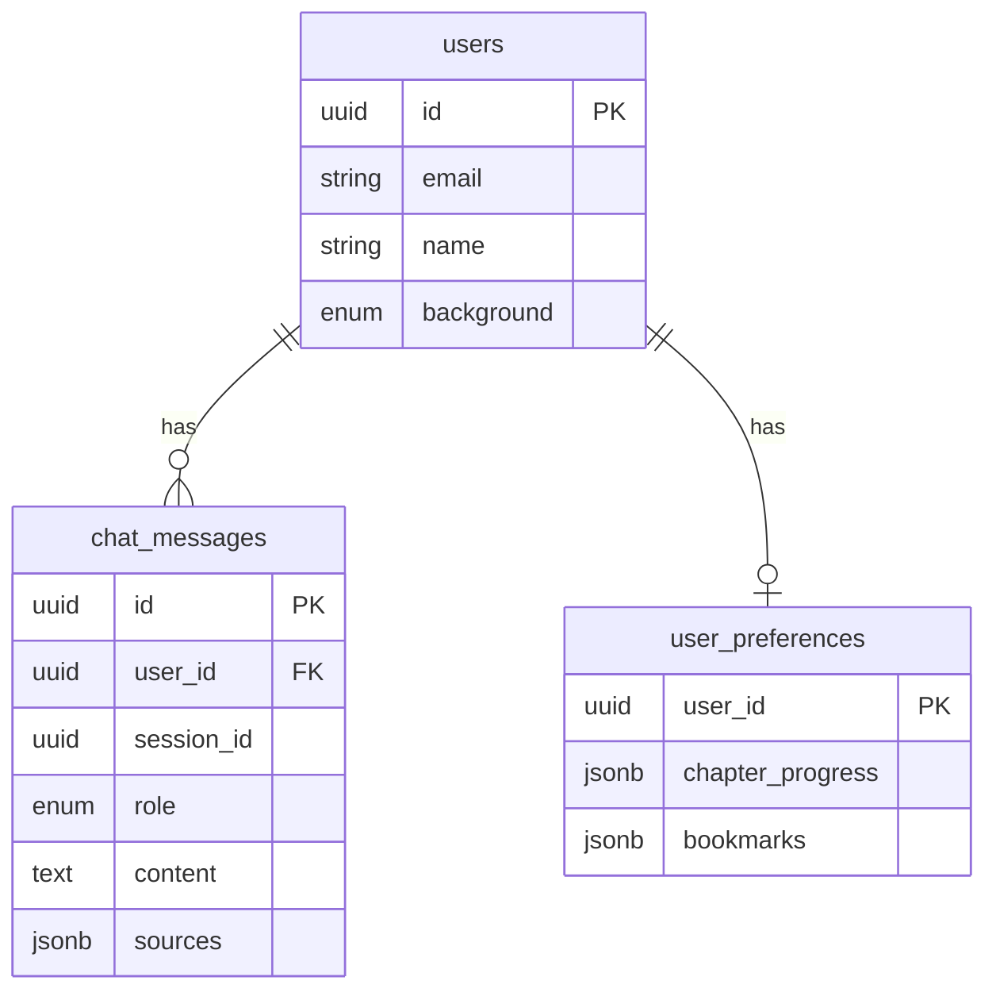

# Data Model: Physical AI & Humanoid Robotics Book

**Feature Branch**: `feature/physical-ai-humanoid-robotics-book`
**Generated**: 2025-12-30
**Research**: [specs/feature/physical-ai-humanoid-robotics-book/research.md](specs/feature/physical-ai-humanoid-robotics-book/research.md)

## Overview

This document defines the data models for the RAG chatbot, authentication system, and personalization features.

---

## 1. User Model (Neon Postgres)

### Table: `users`

| Field | Type | Constraints | Description |
|-------|------|-------------|-------------|
| `id` | UUID | PRIMARY KEY | Unique user identifier |
| `email` | VARCHAR(255) | UNIQUE, NOT NULL | User email address |
| `name` | VARCHAR(100) | NOT NULL | Display name |
| `password_hash` | VARCHAR(255) | NOT NULL | Hashed password |
| `background` | ENUM | NOT NULL | software, hardware, both, none |
| `content_depth` | ENUM | DEFAULT 'detailed' | simplified, detailed |
| `preferred_language` | ENUM | DEFAULT 'en' | en, ur |
| `created_at` | TIMESTAMP | DEFAULT NOW() | Account creation time |
| `updated_at` | TIMESTAMP | DEFAULT NOW() | Last profile update |

### SQL Definition

```sql
CREATE TYPE user_background AS ENUM ('software', 'hardware', 'both', 'none');
CREATE TYPE content_depth_level AS ENUM ('simplified', 'detailed');
CREATE TYPE preferred_locale AS ENUM ('en', 'ur');

CREATE TABLE users (
    id UUID PRIMARY KEY DEFAULT gen_random_uuid(),
    email VARCHAR(255) UNIQUE NOT NULL,
    name VARCHAR(100) NOT NULL,
    password_hash VARCHAR(255) NOT NULL,
    background user_background NOT NULL DEFAULT 'none',
    content_depth content_depth_level NOT NULL DEFAULT 'detailed',
    preferred_language preferred_locale NOT NULL DEFAULT 'en',
    created_at TIMESTAMP WITH TIME ZONE DEFAULT NOW(),
    updated_at TIMESTAMP WITH TIME ZONE DEFAULT NOW()
);

CREATE INDEX idx_users_email ON users(email);
CREATE INDEX idx_users_background ON users(background);
```

---

## 2. Chat History Model (Neon Postgres)

### Table: `chat_messages`

| Field | Type | Constraints | Description |
|-------|------|-------------|-------------|
| `id` | UUID | PRIMARY KEY | Message identifier |
| `user_id` | UUID | FOREIGN KEY → users.id | Reference to user |
| `session_id` | UUID | NOT NULL | Chat session identifier |
| `role` | ENUM | NOT NULL | user, assistant, system |
| `content` | TEXT | NOT NULL | Message content |
| `context_chunks` | INTEGER | DEFAULT 0 | Number of RAG chunks used |
| `sources` | JSONB | NULL | Source chapter references |
| `created_at` | TIMESTAMP | DEFAULT NOW() | Message timestamp |

### SQL Definition

```sql
CREATE TYPE message_role AS ENUM ('user', 'assistant', 'system');

CREATE TABLE chat_messages (
    id UUID PRIMARY KEY DEFAULT gen_random_uuid(),
    user_id UUID REFERENCES users(id) ON DELETE CASCADE,
    session_id UUID NOT NULL,
    role message_role NOT NULL,
    content TEXT NOT NULL,
    context_chunks INTEGER DEFAULT 0,
    sources JSONB,
    created_at TIMESTAMP WITH TIME ZONE DEFAULT NOW()
);

CREATE INDEX idx_messages_user ON chat_messages(user_id);
CREATE INDEX idx_messages_session ON chat_messages(session_id);
CREATE INDEX idx_messages_created ON chat_messages(created_at);
```

---

## 3. User Preferences Model

### Table: `user_preferences`

| Field | Type | Constraints | Description |
|-------|------|-------------|-------------|
| `user_id` | UUID | PRIMARY KEY, FOREIGN KEY → users.id | Reference to user |
| `chapter_progress` | JSONB | DEFAULT '{}' | { chapter_id: completed } |
| `bookmarks` | JSONB | DEFAULT '[]' | Array of bookmarked sections |
| `last_read_chapter` | VARCHAR(100) | NULL | Most recently accessed chapter |
| `theme` | ENUM | DEFAULT 'system' | light, dark, system |

### SQL Definition

```sql
CREATE TYPE theme_preference AS ENUM ('light', 'dark', 'system');

CREATE TABLE user_preferences (
    user_id UUID PRIMARY KEY REFERENCES users(id) ON DELETE CASCADE,
    chapter_progress JSONB DEFAULT '{}'::jsonb,
    bookmarks JSONB DEFAULT '[]'::jsonb,
    last_read_chapter VARCHAR(100),
    theme theme_preference DEFAULT 'system',
    updated_at TIMESTAMP WITH TIME ZONE DEFAULT NOW()
);
```

---

## 4. Qdrant Vector Collection

### Collection: `physical-ai-book`

| Field | Type | Description |
|-------|------|-------------|
| `id` | UUID | Chunk identifier |
| `vector` | ARRAY[FLOAT] | OpenAI embedding (1536 dimensions) |
| `payload` | JSON | Metadata |

### Payload Schema

```json
{
  "chapter_id": "intro",
  "chapter_title": "Introduction to Physical AI",
  "module_id": "module-1",
  "module_title": "The Robotic Nervous System (ROS 2)",
  "section": "concept-explanation",
  "content": "Text content of the chunk...",
  "locale": "en",
  "word_count": 150,
  "chunk_index": 0
}
```

### Collection Configuration

```python
# Qdrant collection settings
collection_config = {
    "vectors": {
        "size": 1536,  # OpenAI text-embedding-3-small
        "distance": "Cosine"
    },
    "optimizers": {
        "indexed_by_payload": ["chapter_id", "module_id", "locale"]
    }
}
```

---

## 5. Chapter Content Model (Markdown)

### Frontmatter Schema

```yaml
---
sidebar_position: 1
sidebar_label: Introduction
module_id: module-1
chapter_id: intro
title: Introduction to Physical AI
locale: en
difficulty: beginner
learning_goals:
  - "Understand Physical AI definition"
  - "Differentiate Digital AI from Physical AI"
tags: [physical-ai, introduction, basics]
---

# Content starts here...
```

### Relationships



---

## 6. State Transitions

### User Onboarding State Machine

```
[Guest]
   │
   ├─→ Sign Up → [Onboarding Pending]
   │
   [Onboarding Pending]
   │
   ├─→ Complete Profile (select background) → [Active User]
   │
   [Active User]
   │
   ├─→ Update Preferences → [Active User]
   ├─→ Start Chat Session → [Chatting]
   │
   [Chatting]
   │
   ├─→ End Session → [Active User]
   └─→ Logout → [Guest]
```

---

## 7. Validation Rules

### User Registration
- Email: Valid format, max 255 chars
- Password: Min 8 chars, must include number
- Name: Non-empty, max 100 chars

### Chat Message
- Content: Non-empty, max 4000 chars
- Role: One of user, assistant, system

### Chapter Progress
- chapter_id: Must match existing chapter
- completed: Boolean

---

## 8. Sample Queries

### Get User Profile with Preferences

```sql
SELECT u.*, up.*
FROM users u
LEFT JOIN user_preferences up ON u.id = up.user_id
WHERE u.id = 'uuid-here';
```

### Get Chat History for Session

```sql
SELECT * FROM chat_messages
WHERE user_id = 'uuid-here' AND session_id = 'uuid-here'
ORDER BY created_at ASC;
```

### Search Book Content (Qdrant)

```python
# Pseudocode for semantic search
results = qdrant.search(
    collection_name="physical-ai-book",
    query_vector=embedding,
    query_filter={
        "must": [
            {"key": "locale", "match": {"value": "en"}}
        ]
    },
    limit=5
)
```
